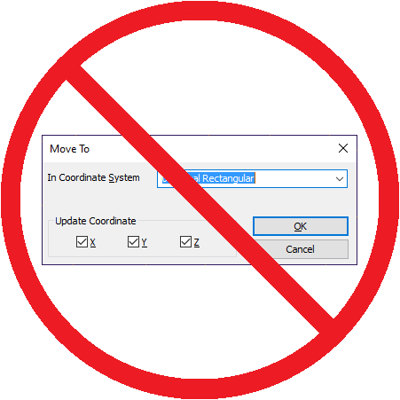

# Femap---Move-Nodes-to-Coords
Skip the XYZ confirmation dialog when moving nodes and save a click!

See also: [How to use Femap Scripts](https://github.com/aaronjasso/How_to_use_Femap_Scripts) and [The List of my Femap Scripts](https://github.com/aaronjasso/My-Femap-Scripts)

---

**This script is license-free** and released into the public domain.

This is the same as clicking _Modify_ > _Move To_ > _Node to Location_ except that it skips the X Y Z confirmatin dialog box and moves the node(s) as if all three direction boxes are checked. The vast majority of times I'm moving a node, I want to move all of its coordinates, so this program moves the node(s) without that annoying confirmation each time.
